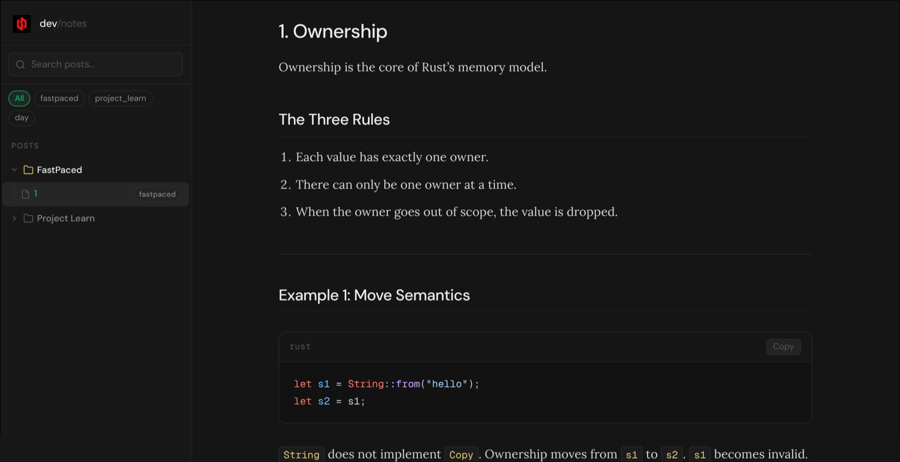

<div align="center">


# 📖 Personal Documentation Blog

**A lightweight, Markdown-powered personal knowledge base — version-controlled with Git and deployable to GitHub Pages in minutes.**

<br/>

[](https://github.com/USERNAME/doc)
[](https://github.com/USERNAME/doc/commits/main)
[](https://github.com/USERNAME/doc/blob/main/LICENSE)
[](https://daringfireball.net/projects/markdown/)
[](https://python.org)

<br/>

[🌐 Live Demo](#-live-preview) · [✨ Features](#-features) · [🚀 Quick Start](#-quick-start) · [📁 Structure](#-project-structure) · [🤝 Contributing](#-contributing)

</div>

---

## 🌐 Live Preview

> Once deployed with GitHub Pages, your documentation site is accessible at:

```
https://USERNAME.github.io/doc
```

> *(Replace `USERNAME` with your actual GitHub username.)*

---

## 📸 Screenshot

<div align="center">



*The clean, minimal interface of the documentation site.*

</div>

---

## ✨ Features

| Feature | Description |
|---|---|
| 📝 **Markdown Posts** | Write content in plain Markdown — no HTML required |
| 🗂️ **Organized Categories** | Posts are grouped into structured topic folders |
| ⚡ **Static & Fast** | No server required — pure HTML, CSS, and JavaScript |
| 🔁 **Auto Indexing** | Python script auto-registers posts into `posts.json` |
| 🎨 **Clean UI** | Minimal, readable HTML + CSS interface |
| 🚀 **GitHub Pages Ready** | One-click deployment to GitHub Pages |
| 🔐 **Version Controlled** | Full Git history of every post and change |
| 📦 **Zero Dependencies** | No npm, no build tools, no frameworks required |

---

## 🚀 Quick Start

### Prerequisites

- [Python 3.x](https://www.python.org/downloads/)
- [Git](https://git-scm.com/)

### 1. Clone the repository

```bash
git clone https://github.com/USERNAME/doc.git
cd doc
```

### 2. Start local development server

```bash
python -m http.server
```

Then open your browser and go to:

```
http://localhost:8000
```

---

## 📁 Project Structure

```
doc/
├── 📄 index.html              # Main page — loads and renders posts dynamically
├── 🎨 style.css               # Site-wide stylesheet
├── 🐍 python_post_manager.py  # CLI tool to register/manage posts
├── 📋 posts.json              # Auto-generated post index (registry)
├── 🖼️  favicon.jpeg            # Site favicon
├── 📁 posts/                  # All blog/documentation posts
│   ├── FastPaced/
│   │   └── 1.md
│   └── Project_Learn/
│       ├── Day1.md ... Day9.md
├── 📁 store/
│   └── Area_screenshot.png    # Assets and screenshots
└── 📄 README.md
```

---

## 🔧 How It Works

The workflow is intentionally simple:

```
Write Markdown → Run Python Manager → Auto-update posts.json → index.html renders posts
```

1. **Write** your documentation in Markdown inside a `posts/` subfolder
2. **Run** the Python post manager to register your post
3. **Commit** and push — if deployed, the site updates automatically

The `index.html` dynamically reads `posts.json` and renders all registered posts — no manual HTML editing needed.

---

## ✍️ Writing a New Post

**Step 1 — Create a Markdown file** inside the appropriate category folder:

```bash
# Example: adding a new learning day
posts/Project_Learn/Day10.md
```

**Step 2 — Register the post** by running the Python manager:

```bash
python python_post_manager.py
```

This updates `posts.json` automatically.

**Step 3 — Commit and push** your changes:

```bash
git add .
git commit -m "docs: add Day10 learning log"
git push
```

---

## 🌍 Deploying with GitHub Pages

1. **Push** your repository to GitHub

2. Go to your repository → **Settings** → **Pages**

3. Under **Source**, select:
   - **Branch:** `main`
   - **Folder:** `/ (root)`

4. Click **Save** — GitHub will publish your site automatically.

Your live site will be available at:

```
https://USERNAME.github.io/doc
```

> ⏱️ *Deployment may take 1–2 minutes on first publish.*

---

## 🤝 Contributing

Contributions are welcome! Whether it's fixing a typo, improving the UI, or adding a new feature — feel free to open a PR.

```bash
# 1. Fork the repository on GitHub

# 2. Clone your fork
git clone https://github.com/YOUR_USERNAME/doc.git

# 3. Create a feature branch
git checkout -b feature/your-improvement

# 4. Make your changes, then commit
git commit -m "feat: describe your improvement"

# 5. Push and open a Pull Request
git push origin feature/your-improvement
```

---

## 🗺️ Roadmap

- [ ] 🔍 Search functionality
- [ ] 🏷️ Tagging and filtering system
- [ ] 🌙 Dark mode support
- [ ] 📅 Post metadata (date, tags, summary)
- [ ] 📡 RSS feed generation
- [ ] ⚙️ Automatic deployment workflow (GitHub Actions)
- [ ] 🖥️ Improved responsive UI layout
- [ ] 🔄 Markdown → HTML rendering pipeline

---

## 🎯 Purpose

This project is part of a **continuous learning and documentation workflow**. The goal is to:

- 📈 Track development progress over time
- 📚 Maintain structured, searchable learning notes
- 🧠 Build a personal knowledge base
- 🗃️ Keep technical documentation clean and organized

---

## 📄 License

This project is available for **personal and educational use**.  
See the [LICENSE](LICENSE) file for details.

---

## 👤 Author

Maintained as part of an ongoing documentation and learning practice.

<div align="center">


*Made with ❤️ and Markdown*

</div>